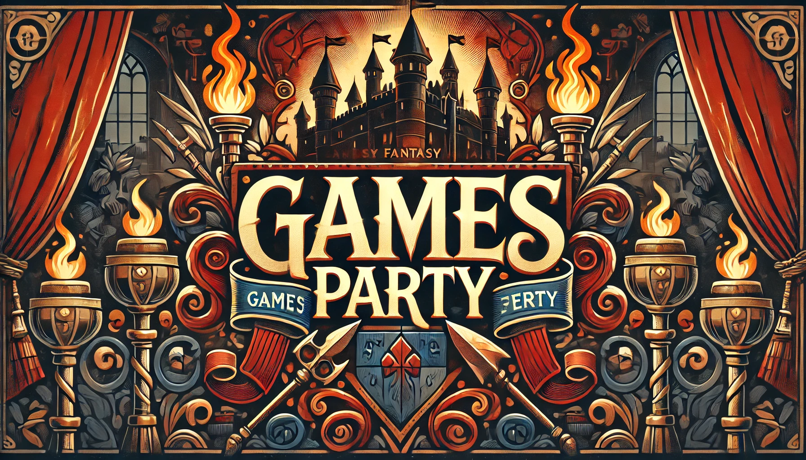

# 🎮 Games Party

Bem-vindo ao **Games Party**! Um site temático para os apaixonados por games, com visual moderno e foco em jogos populares como League of Legends, Fortnite, Valorant, CS:GO, e muito mais.



---

## 📂 Estrutura do Projeto

- `Index.html`: Página principal com a estrutura HTML do site.
- `style.css`: Estilo visual com design responsivo.
- `index.js`: Interações e scripts JavaScript.
- `img/`: Imagens ilustrativas dos jogos.
- `IconesImg/`: Ícones de redes sociais (Instagram, WhatsApp, Discord).

---

## 🚀 Como Visualizar o Projeto

1. Clone este repositório:
   ```bash
   git clone https://github.com/seu-usuario/Games-Party-main.git
Acesse a pasta do projeto:


cd Games-Party-main
Abra o arquivo Index.html em seu navegador.

🛠 Tecnologias Utilizadas
- HTML5
- CSS3
- JavaScript Vanilla

💡 Funcionalidades
Layout com imagens dinâmicas dos jogos.

Ícones de redes sociais com links.

Estrutura pronta para expandir com novas páginas ou interações JS.

📸 Preview

📬 Contato
Entre em contato pelas redes sociais incluídas no site ou envie um e-mail para: jhonathan.enio@hotmail.com
